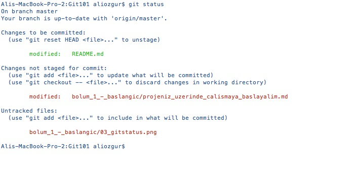
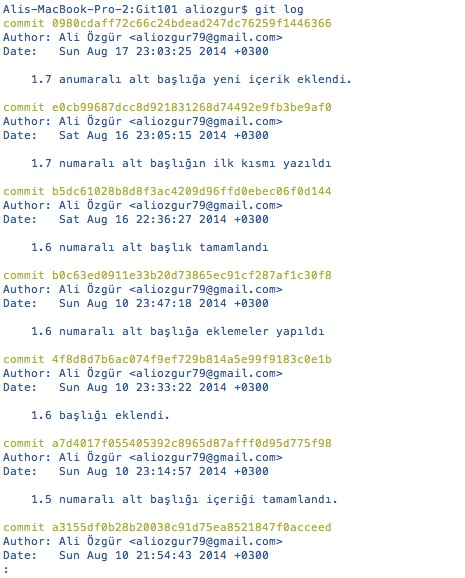
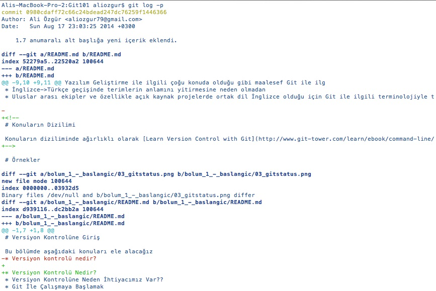

# Projemiz Üzerinde Çalışmaya Başlayalım

Üzerinde çalışacağımız projenin dosyaları artık yerel diskimizde yer aldığına göre projemiz ile ilgili normal çalışmamıza başlayabiliriz.

> Projenizi ister local bir proje olarak oluşturmuş olun isterseniz remote bir repository'yi klonlamış olun tüm değişiklikleriniz yerel diskinizde gerçekleşecek ve **commit’leriniz** ile oluşturacağınız tüm versiyonlar git tarafından yerel diskinizdeki .git klasöründe takip edilecektir. İlerleyen bölümlerde ayrıntılı olarak ele alacağımız **git push** komutunu çalıştırmadığınız sürece yaptığınız değişiklikler sadece yerel diskinizde kayıt altına alınır.

## Dosya Durumları

Git'de dosyalarınız genel olarak iki durumda olabilir

* Untracked \(Takip Edilmeyen\): Bu dosyalar versiyon kontrolü altında olmayan veya sizin henüz versiyon kontrolü yapmak için git'e eklemediğiniz dosyalardır. Bu dosyalardaki değişiklikler siz dosyaları git'e eklemediğiniz sürece versiyon kontrolüne tabi değildir
* Tracked \(Takip Edilen\): Bu dosyalar ise git'in versiyon kontrolü takibi altında olan dosyalardır. Bu dosyalar üzerinde yapacağınız tüm değişiklikler git tarafından takip edilmektedir.

## Staging Area

Çoğu versiyon kontrol sisteminde değişiklikleriniz iki yerde kaydedilir

* Yerel diskinizdeki çalışma klasörünüz \(working folder\) veya
* Versiyon kontrol sisteminin veri tabanı

Ancak git'de değişikliklerinizin kayıt altına alındığı üçüncü bir alan daha vardır ki buna **Staging Area** denir ve git'in en temel kavramlarından birisidir. Staging Area'yı, proje dosyalarımızdaki bir dizi değişikliği remote repository'ye göndermeden önce kayıt altında tuttuğunuz veri tabanı/alan olarak tanımlayabiliriz.

Versiyon Kontrolünün Altın Kuralları

\#1 Sadece Birbiri İle Alakalı Değişiklikleri Commit Edin

 Değişikliklerinizi commit etmeye karar verdiğinizde birbiri ile alakalı değişiklikleri tek bir commit olarak ele almaya özen gösterin. Birbiri ile alakalı olmayan değişiklikleri aynı commit ile versiyon kontrol sisteminde kayıt altına aldığınızda aşağıdakilere benzer sorunlar yaşama ihtimaliniz artacaktır

*  Commit’inizdeki değişiklikleri inceleyen ekip arkadaşlarınız yaptığınız değişikliklerden hangisinin hangi konu ile ilgili olduğunu anlamakta güçlük çekeceklerdir.
* Alakalı alakasız değişiklikler tek bir commit içinde yer aldığı için herhangi bir nedenle belirli ve tek bir değişikliği geri almakta güçlük çekeceksiniz.

 Alakalı alakasız değişiklikleri tek bir commit ile ele almak yerine örneğin iki ayrı sorunu gidermek için yaptığınız değişiklikler iki ayrı commit ile kayıt altına alınmalı veya daha büyük bir özellik üzerinde çalışırken bu özelliği oluşturan ve anlamsal bir bütün olarak ifade edilen daha küçük özellikleri de ayrı commit’ler ile kayıt altına almalısınız.

Projeniz üzerinde çalışırken belirli bir zaman aralığında yaptığınız değişikliklerin tamamının aynı konu veya özellikle ilgili olması mümkün olmayacaktır. Tam da bu noktada **Staging Area** mekanizmasının güzelliği ortaya çıkar, çünkü git hangi değişikliğinizin Staging Area'ya gideceğine karar vermeniz için sizin devreye girmenizi ister. Daha önce de belirttiğimiz gibi yaptığınız değişiklikler git tarafından otomatik takip edilmez, bunun yerine git tüm değişiklikleri sizin gözden geçirerek kontrollü bir şekilde Staging Area'ya almanızı ister.

## Yaptığınız Değişiklikleri Listelemek

Son commit işleminizden sonra proje dosyalarınızda yaptığınız değişiklikleri listelemek için **git status** komutunu kullanabilirsiniz.

 Yukarıdaki terminal ekran görüntüsünde de görebileceğiniz gibi git oldukça ayrıntılı durum bilgisi sunmaktadır. **git status** komutu ile git aşağıdaki 3 ana grupta yer alan dosyaları size listeler

* Changes to be committed \(Commit edilmeye hazır dosyalar\): Bu gruptaki dosyalar **git add** veya **git rm** komutu ile Staging Area'ya eklediğimiz dosyalardır. Bu dosyalar bir sonraki commit'imizin içinde yer alacaktır
* Changes not staged for commit \(Commit için henüz hazır olmayan dosyalar\): Bu gruptaki dosyalar değişiklik yaptığımız fakat henüz Staging Area'ya eklemediğimiz  dosyalardır. Bu dosyalar bir önceki grubun içine eklemediğimiz sürece bir sonraki commit'e dahil olmayacaklarıdır
* Untracked files \(Versiyon takibinde olmayan dosyalar\): Bu gruptaki dosyalar ise henüz versiyon kontrolü altına almadığımız dosyalardır.

## "git add" ve "git rm" komutları

Bir önceki başlıkta değindiğimiz ve **git status** komutu sonrasında git'in bize özetlediği 3 gruptan son ikisinde yer alan dosyaların ilk gruba dahil edilmesi için **git add** ve **git rm** komutlarını kullanabiliriz.

Aşağıda oluşturduğumuz **git add** komutu ile **baslik\_2.md** ve **baslik\_2\_1.md** dosyaları ile **resimler** klasörü altındaki tüm dosyaların Staging Area'ya eklenmesini sağlayabiliriz.

> $ **git add** baslik\_2.md baslik\_2\_1.md resimler/\*

Benzer şekilde aşağıdaki **git rm** komutu ile **ornek2.md** dosyasının bir sonraki commit’imizde yer almayacağını belirtebiliriz.

> $ **git rm** ornek2.md

## Değişikliklerimizi Commit Edelim

Değişikliklerinizi **git add** ve **git rm** ile Staging Area'ya aldıktan sonra **git commit** komutu ile yeni bir versiyon olarak kayıt altına alabilirsiniz.

> $ **git commit** -m "1.7 numaralı alt başlık içeriği tamamlandı"

Yukarıdaki komutta yer alan **-m** parametresi ile yaptığınız değişiklikleri özetleyen bir mesajı da commit'inize ekleyebilirsiniz. Eğer birden fazla satırı olan bir commit mesajı gireceksiniz **-m** parametresini kaldırmanız yeterli olacaktır. Bu durumda 1.3 numaralı bölümde ayarladığınız editör açılır ve bu editöre mesajınızı istediğimiz uzunlukta girebilirsiniz.

Versiyon Kontrolünün Altın Kuralları

\#2 Anlamlı Commit Mesajları

 Commit işlemi sırasında yazacağınız bilgilendirici bir mesaj hem ekibinizdeki diğer kişilerin hem de daha sonra kendinizin yapılan değişikliği daha rahat ve hızlı anlamanızı sağlayacaktır. Mesajınıza kısa bir özet satırı yazdıktan sonra bir sonraki satırda da değişikliğin nedeni ve içeriği hakkında bilgi verebilirsiniz.

### İyi Bir Commit Nasıl Olmalı?

1. Commit'inizde sadece kavramsal olarak ilişkili değişiklikleri içermeye özen göstermelisiniz. Zaman zaman iki farklı konu veya sorun ile ilgili aynı anda veya çok kısa aralıklarla değişimli olarak çalışmak zorunda kalabilirsiniz. Bu şekilde yapılan bir çalışma sonrasında commit zamanı geldiğinde mümkün ise iki konu ile ilgili değişikliklerinizi bir defada commit etmek yerine iki defada ayrı ayrı commit edin. Bu çok zor oluyorsa kısa yoldan bir anda tek bir değişikliğe odaklanmayı da düşünebilirsiniz.
2. Tamamlanmamış değişikliklerinizi kesinlikle commit etmemeye özen gösterin. Eğer zaman zaman değişikliklerinizi kayıt altına almak istiyorsanız commit işlemi yerine Git'in **Stash** özelliğini/komutunu kullanabilirsiniz.
3. Test edilmemiş değişiklikleri commit etmemeye özen gösterin. Bu öneri aslında bir önceki önerimiz ile pratikte aynı anlama geliyor
4. Commit'leriniz kısa ve açıklayıcı mesajlar içermeli.
5. Son olarak da sık sık commit işlemi yapmayı alışkanlık haline getirmenizi önerebiliriz. Bu alışkanlık ile birlikte yukarıdaki maddeleri de yerine getirebilirseniz iş yapma şekliniz ve konsantrasyonunuz da olumlu yönde etkilenecektir.

## Commit Tarihçesi

Git projeniz üzerinde çalıştığınız her anda yaptığınız commit işlemlerini kayıt altına almaktadır. Özellikle ekip çalışması söz konusu ise commit işlemleri ile ilgili git tarafından kayıt altına alınan bu bilgiler daha da önem kazanmaktadır.

Git'in commit’leriniz ile ilgili kayıt altına aldığı tarihsel bilgileri görmek için **git log** komutunu kullanıyoruz. Bu komut tüm commit’ler ile ilgili bilgileri, en son commit en üstte olacak şekilde, tarihsel olarak sıralar. Eğer Terminal pencerenize sığmayacak kadar çok tarihsel kayıt var ise son satırda **:** simgesi yer alacaktır, klavyenizden **SPACE/BOŞLUK** tuşuna basarak bir sonraki sayfanın listelenmesini **q** tuşuna basarak da listelemenin sonlandırılmasını sağlayabilirsiniz.

Terminal'de listelenen her commit tarihçesi kaydı, diğer bilgilerin yanı sıra, aşağıdaki temel bilgileri içerir

* Commit'in Hash değeri
* Commit'i gerçekleştiren kişinin adı ve email'i
* Commit tarihi
* Commit mesajı

> **Commit Hash** : Her bir commit'in benzersiz ve tek bir tanımlayıcı değeri vardır. Bu değer git tarafından commit'e dahil olan tüm değişiklikleriniz ve commit'in kendisi ile ilgili bilgiler de kullanılarak otomatik hesaplanır. Genel olarak git'in listelemelerinde ve bazı komutların parametresi olarak bu değerin ilk 7 karakterinin kullanılması yeterlidir. Çünkü bu ilk 7 karakterin de nerdeyse benzersiz ve tekil olduğunu söyleyebiliriz.

git log komutu ile birlikte commit işlemi ile ilgili bilgilendirici çoğu bilgiyi görmekle birlikte parametre olarak **-p** değerini kullanırsanız dosyalarda yapılan değişiklikler de ayrıntılı olarak listelenecektir.

Kitabımızın ilerleyen bölümlerinde **git log -p** komutu ile gördüğümüz bilgileri nasıl yorumlayacağımızı ayrıntılı olarak ele alacağız.

