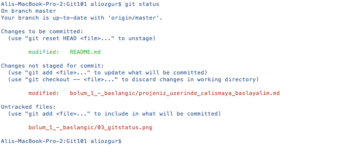

# Projemiz Üzerinde Çalışmaya Başlayalım

Üzerinde çalışacağımız projemizin dosyaları artık yerel diskimizde yer aldığına göre projemiz ile ilgili normal çalışmamıza başlayabiliriz.

> Projenizi ister local bir proje olarak oluşturmuş olun isterseniz remote bir repository'yi klonlamış olun tüm değişiklikleriniz yerel diskinizde gerçekleşecek ve **commitleriniz** ile oluşturacağınız tüm versiyonlar git tarafından yerel diskinizdeki .git klasöründe takip edilecektir. İlerleyen bölümlerde ayrıntılı olarak ele alacağımız **git push** komutunu çalıştırmadığınız sürece yaptığınız değişiklikler sadece yerel diskinizde kayıt altına alınır.

## Dosya Durumları
Git'de dosyalarınız genel olarak iki durumda olabilir

* Untracked (Takip Edilmeyen): Bu dosyalar versiyon kontrolü altında olmayan veya sizin henüz versiyon kontrolü yapmak için git'e eklemediğiniz dosyalardır. Bu dosyalardaki değişiklikler siz dosyaları git'e eklemediğiniz sürece versiyon kontrolüne tabi değildir
* Tracked (Takip Edilen): Bu dosyalar ise git'in versiyon kontrolü takibi altında olan dosyalardır. Bu dosyalar üzerinde yapacağınız tüm değişiklikler git tarafından takip edilmektedir.

## Staging Area

Çoğu versiyon kontrol sisteminde değişiklikleriniz iki yerde kaydedilir

* Yerel diskinizdeki çalışma klasörünüz (working folder) veya
* Versiyon kontrol sisteminin veritabanı

Ancak git'de değişikliklerinizin kayıt altına alındığı üçüncü bir alan daha vardır ki buna **Staging Area** denir ve git'in en temel kavramlarından birisidir. Staging Area'yı, proje dosyalarımızdaki bir dizi değişikliği remote repository'ye göndermeden önce kayıt altında tuttuğunuz veritabanı/alan olarak tanımlayabiliriz.

Versyon Kontrolünün Altın Kuralları

#1 Sadece Birbiri İle Alakalı Değişiklikleri Commit Edin

Değişikliklerinizi commit etmeye karar verdiğinizde birbiri ile alakalı değişiklikleri tek bir commit olarak ele almaya özen gösterin. Birbiri ile alakalı olmayan değişiklikleri aynı commit ile versiyon kontrol sisteminde kayıt altına aldığınızda aşağıdakilere benzer sorunlar yaşama ihtimaliniz artacaktır
<ul>
<li> Commitinizdeki değişiklikleri inceleyen ekip arkadaşlarınız yaptığınız değişikliklerden hangisinin hangi konu ile ilgili olduğunu anlamakta güçülük çekeceklerdir.
</li>
<li>Alakalı alakasız değişiklikler tek bir commit içinde yer aldığı için herhangi bir nedenle belirli ve tek bir değişikliği geri almakta güçülük çekeceksiniz.
</li>
</ul>
Alakalı alakasız değişiklikleri tek bir commit ile ele almak yerine örneğin iki ayrı sorunu gidermek için yaptığınız değişiklikler iki ayrı commit ile kayıt altına alınmalı veya daha büyük bir özellik üzerinde çalışırken bu özelliği oluşturan ve anlamsal bir bütün olarak ifade edilen daha küçük özellikleri de ayrı commitler ile kayıt altına almalısınız.

Projeniz üzerinde çalışırken belirli bir zaman aralığında yaptığınız değişikliklerin tamamının aynı konu veya özellikle ilgili olması mümkün olmayacaktır. Tam da bu noktada **Staging Area** mekanizmasının güzelliği ortaya çıkar, çünkü git hangi değişikliğinizin Staging Area'ya gideceğine karar vermeniz için sizin devreye girmenizi ister. Daha önce de belirttiğimiz gibi yaptığınız değişiklikler git tarafından otomatik takip edilmez, bunun yerine git tüm değişiklikleri sizin gözden geçirerek kontrollü bir şekilde Staging Area'ya almanızı ister.

## Yaptığınız Değişiklikleri Listelemek

Son commit işleminizden sonra proje dosyalarınızda yaptığınız değişiklikleri listelemek için **git status** komutunu kullanabilirsiniz.

Yukarıdaki terminal ekran görüntüsünde de görebileceğiniz gibi git oldukça ayrıntılı durum bilgisi sunmaktadır. **git status** komutu ile git aşağıdaki 3 ana grupta yer alan dosyaları size listeler

* Changes to be committed (Commit edilmeye hazır dosyalar): Bu gruptaki dosyalar **git add** veya **git rm** komutu ile Staging Area'ya eklediğimiz dosyalardır. Bu dosyalar bir sonraki commit'imizin içinde yer alacaktır
* Changes not staged for commit (Commit için henüz hazır olmayan dosyalar): Bu gruptaki dosyalar değişiklik yaptığımız fakat henüz Staging Area'ya eklemediğimzi dosyalardır. Bu dosyalar bir önceki grubun içine eklemediğimiz sürece bir sonraki commit'e dahil olmayacaklarıdır
* Utracked files (Versiyon takbinide olmayan dosyalar): Bu gruptaki dosyalar ise henüz versiyon kontrolü altına almadığımız dosyalardır.

## "git add" ve "git rm" komutları

Bir öncelki başlıkta değindiğimiz ve **git status** komutu sonrasında git'in bize özetlediği 3 gruptan son ikisinde yer alan dosyaların ilk gruba dahil edilmesi için **git add** ve **git rm** komutlarını kullanabiliriz.

Aşağıda oluşturduğumuz **git add** komutu ile **baslik_2.md** ve **baslik_2_1.md** dosyaları ile **resimler** klasörü aştındaki tüm dosyaların Staging Area'ya eklenmesini sağlayabiliriz.

> $ **git add** baslik_2.md baslik_2_1.md resimler/*

Benzer şekilde aşağıdaki **git rm** komutu ile **ornek2.md** dosyasının bir sonraki commitimiz'de yer almayacağını belirtebiliriz.

> $ **git rm** ornek2.md

## Değişikliklerimizi Commit Edelim
Değişikliklerinizi *git add* ve *git rm* ile Staging Area'ya aldıktan sonra **git commit** komutu ile yeni bir versiyon olarak kayıt altına alabilirsiniz.

> $ **git commit** -m "1.7 numaralı alt başlık içeriği tamamlandı"

Yukarıdaki komutta yer alan **-m** parametresi komutun commit mesajı ile birlikte oluşturulmasını sağlar. Eğer birden fazla satırı olan bir commit mesajı gireceksiniz **-m** parametresini kaldırmanız yeterli olacaktır. Bu durumda 1.3 numaralı bölümde ayarladığınız editör açılır ve bu editör'e mesajınızı istediğimiz uzunlukta girebilirsiniz.

Versyon Kontrolünün Altın Kuralları

#2 Anlamlı Commit Mesajları

Commit işlemi sırasında yazacağınız dengeli ve bilgilendirici bir commit mesajı hem ekibinizdeki diğer kişilerin hem de daha sonra sizin kendinzin yapılan değişikliği daha rahat ve hızlı anlamanızı sağlayacaktır. Commit mesajınıza kısa bir özet satırı yazdıktan sonra bir sonraki satırda da değişikliğin nedeni ve içeriği hakkında bilgi veriniz.

