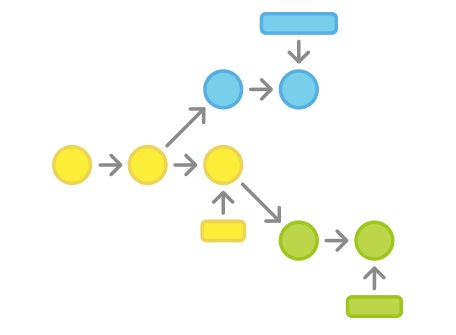

# Versiyon  Kontrolü Nedir?

Versiyon kontrolü nedir ve bizi neden ilgilendirmeli? Versiyon kontrolünü bir dosya veya bir küme dosyadaki değişiklikleri takip edebilmek için uyguladığımız bir yöntem olarak tanımlayabiliriz. Git gibi sistemler tüm bu değişikliklerin tarihçesini ve içeriğini elektronik olarak bizim için takip ederek kayıt altına almamızı sağlayan veri tabanları olarak düşünülebilir.

Bu sistemleri kullanarak herhangi bir anda üzerinde çalıştığınız dosyaların o anki hallerini kaydedebilir, daha sonra da isterseniz bu dosyaların kaydedilmiş ve kontrol altına alınmış herhangi bir haline geri dönebilirsiniz.

> Dosyaların kayıt altına alınmış herhangi bir andaki hallerine **versiyon** diyoruz

[_Görsel : Atlassian Git Workflows sayfasından alıntı_](https://www.atlassian.com/git/workflows)

Versiyon kontrolünü, kullandığınız programlama dili, yardımcı programlama kütüphaneleri \(framework\), dosya tipi veya işletim sisteminden bağımsız bir yaklaşım olarak düşünmelisiniz. Çünkü versiyon kontrolü

* HTML dosyalar için kullanılabileceği gibi, mimari tasarım amaçlı proje dosyaları ve iPhone uygulaması kaynak kodunuz için de kullanılabilir
* Dosyalarınız üzerinde çalışırken hangi işletim sistemini veya hangi programları kullandığınız ile ilgilenmez \(Sublime Text, Notepad, Visual Studio, Word, AutoCAD\)

> Ben de bu kitabın versiyon kontrolü için **Git** kullanıyorum

Versiyon kontrol sistemleri en basit anlamda **dosyalarınızdaki değişikliklerin tarihçesini takip edip kayıt altında tutan** sistemlerdir. Bu nedenle versiyon kontrol sistemlerini yedekleme veya diğer yazılım geliştirme araçları ile karşılaştırmak doğru olmaz.

## [**Kitabın basılı halini online olarak da satın alabilirsiniz**](https://www.dikeyeksen.com/products/git-ile-versiyon-kontrolu)

