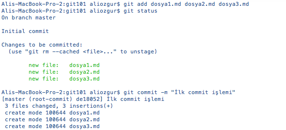

# Branch'ler İle Çalışmak

Git'de branch'leri daha iyi anlamak için bir adım geri gidip Git'in sizin yaptığınız değişiklikleri nasıl kaydettiğine bakmamız gerekiyor. Git bu değişiklikleri ayrı ayrı kayıt altına almak yerine (diff veya changeset olarak) değişikliğinizi commit ettiğiniz anda  dosyalarınızın tümünün o anki hallerini kayıt altına alır (snapshot).

**git commit** komutu ile değişikliklerinizi commit ettiğinizde Git commit'iniz ile ilgili bilgileri içeren bir **commit nesnesi** oluşturur. Bu commit nesnesi'nde

* Commit'i kimin ne zaman yaptığı
* Dosyalarınızın o anki durumuna gösteren  bir işaretçi
* Sizin commit işleminden önce yapılan commit işlemlerini gösteren işaretçiler

gibi bilgiler yer alır.

Gelin bir örnek ile yukarıda bahsettiğimiz commit nesnesinin nasıl oluştuğunu daha iyi açıklamaya çalışalım. Tek bir klasör altında 3 dosyadan oluşan basit bir projemiz olduğunu ve bu projemizin versiyon kontrolünü Git ile yaptığımızı varsayalım. Bu dosyaların üçünde de değişiklikler yaptıktan sonra bu dosyaları **git add** komutu ile önce Staging Area'mıza ekleyelim sonrasında da **git commit** ile değişikliklerimizi commit edelim.

Staging (git add) işlemi sırasında Git değiştirdiğiniz dosyaların her birinin SHA-1 Hash değerini hesaplar ve dosyaların o anki durumlarını kayıt altına alarak hesaplanan Hash değerini Staging Area'ya yazar. Commit işlemi yapıldığında ise Git ana klasörümüzün (birden fazla klasörümüz olsaydı bu işlem her bir klasör için yapılacaktı) [checksum](http://en.wikipedia.org/wiki/Checksum) değerini hesaplar ve bu üç dosyayı *repository*'de kayıt altına alır. Bu işlemler sonrasında git bir commit nesnesini oluşturur ve
