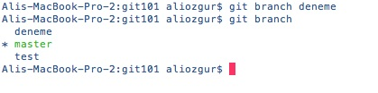
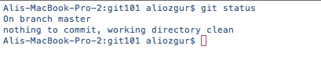
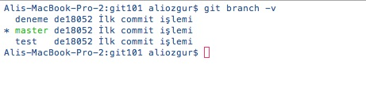
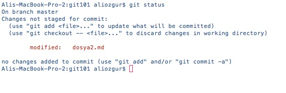

# Branch'ler İle Çalışmak

Git'de branch kullanımı tercihe bağlı değildir, aslında farkında olmasanız bile projeniz üzerinde çalışırken her zaman aktif tek bir branch üzerinde çalışırsınız. Git'de projenizi ilk oluşturduğunuzda Git varsayılan olarak sizin için **master** adı verilen bir branch oluşturur ve siz bu branch üzerinde çalışmaya başlarsınız.

Gelin şimdi **git branch** komutunun basit kullanımı ile ilgili birkaç örnek görelim.

 **git branch deneme** komutunu çalıştırdığınızda git sizin için projenizdeki dosyaların o anki halini barındıran **deneme** isimli bir branch oluşturur.

> Git **git branch** komutu ile oluşturduğunuz yeni branch'i otomatik olarak aktif hale getirmez.

Branch'inizi oluşturduktan sonra **git branch** komutunu çalıştırdığınızda git size projeniz için oluşturduğunuz tüm branch'leri listeler ve aktif olan branch'i başına da  **\***  simgesi olacak şekilde gösterir.

> **git status** komutunu çalıştırdığınızda da aktif olan branch "On branch ...." ifadesi ile gösterilir 

Branch'leriniz ile ilgili daha fazla ayrıntı görmek için ise **git branch** komutunu **-v** parametresi ile çalıştırabilirsiniz.

Yeni oluşturduğumuz branch ile çalışmaya başlamadan önce gelin bir defa daha **git status** komutu ile projemizin ne durumda olduğuna bakalım.

Yukarıdaki ekran görüntüsünde de gördüğümüz üzere aktif olan **master** branch'imizde _dosya2.md_ isimli dosyamızda henüz commit etmediğiniz bir değişiklik var. Bu dosyadaki değişikliğin yeni eklediğimiz branch'de yer almasını istemediğimizi ve henüz tam anlamıyla bitirilmediğini varsayalım. Bu durumda dosyadaki değişikliği commit mi etmeliyiz yoksa tamamen göz ardı mı etmeliyiz?

Versiyon Kontrolünün Altın Kuralları

\#4 Yarım Yamalak Değişiklikleri Asla Commit etmeyin

 Tam anlamıyla bitirmediğiniz ve test etmediğiniz bir değişikliği asla commit etmeyin. Üzerinde çalışacağınız değişiklikleri planlarken bu değişiklikleri mümkün olduğunca küçük parçalar halinde ele almaya özen gösterirseniz yaptığınız değişiklikleri kayıt altına almak için henüz tamamlanmamış değişiklikleri commit etmek zorunda kalmazsınız. Buna rağmen ara safhada kayıt altına almak istediğiniz değişiklikler olursa Git'in \*\*Stash\*\* özelliğini kullanabilirsiniz.

