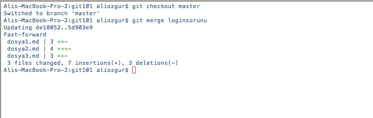
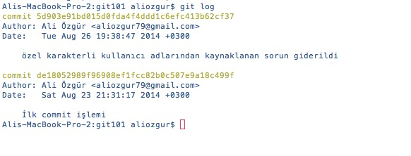
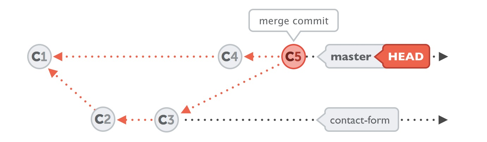

# Değişiklikleri Merge Etmek

Projemizde yaptığımız farklı konular ve bağlamlardaki değişiklikleri takip etmek bir önceki bölümde anlattığımız basit iş akışı ile günlük çalışmamızda bize ciddi kolaylıklar ve esneklikler sunmaktadır. Ancak branch'lerimiz üzerinde değişikliklerimizi tamamlayıp Staging ve Commit işlemlerimizi yaptıktan sonra tüm bu değişiklikleri projemizin stabil versiyonu olan **master** branch ile merge etmemiz gerekiyor _\(branch -&gt; \[merge\] -&gt; master\)_. Merging en basit anlamda herhangi bir brach'de yaptığımız değişiklikleri **master** branch'imiz ile birleştirme veya **master** branch'e entegre etme işlemidir.

> Bir branch'deki değişikliklerinizi sadece **master** branch’iniz ile merge etmek zorunda değilsiniz. Kullandığınız Git çalışma pratiğine bağlı olarak herhangi bir branch'i başka bir branch'e merge edebilirsiniz.

Değişikliklerinizi **master** branch’inize merge etmek durumlardan sadece bir tanesidir, günlük çalışmanız sırasında karşılaşacağınız diğer bir durum ise üzerinde çalıştığınız branch'e **master** branch'deki değişikliklerin merge edilmesidir _\(master -&gt; \[merge\] -&gt; branch\)_. Bu durumu doğurabilecek aşağıdakilere benzer durumlar ile karşılaşabilirsiniz

* Büyük bir ekipte çalışıyorsunuz ve ekip arkadaşlarınız yaptıkları değişiklikleri sık sık **master** branch'e merge ediyorlar. Bu durumda siz de uzun zamandır üzerinde çalıştığınız branch'in master'dan geri kalmaması için merge işlemi yapmak isteyebilirsiniz.
* Tek başınıza çalışıyorsunuz ancak farklı zamanlarda farklı sebepler ile master branch'e merge ettğiniz bir çok düzeltme yaptınız. Diğer yandan da daha uzun soluklu bir çalışmanızı ayrı bir branch üzerinde yapıyorsunuz. Üzerinde çalıştığınız branch'in master'daki değişikliklerden geri kalmaması için merge işlemi yapmak isteyebilirsiniz.

> **Commit'leri değil branch'leri entegre etmek!** Git'de değişikliklerinizi merge etme işlemi sırasında kaynak branch'inizde tekil olarak hangi değişiklikleri \(commit'ler\) merge etmek istediğinizi teker teker söylemezsiniz. Bunun yerine Git'de doğrudan kaynak branch'inizin tamamını hedef branch'e merge edersiniz, çünkü git hangi değişikliklerin hedef branch'de bulunmadığını otomatik olarak tespit edip sadece bunların entegre edilmesini sağlar. Kaynak branch'deki değişiklikler her zaman HEAD'e yani aktif branch'iniz hangisi ise ona entegre edilir.

Git'de merge işlemi çok basit iki adımda yapılır. 1. **git checkout** komutu ile değişikliklerin aktarılacağı hedef branch'inizi aktif \(HEAD\) hale getirirsiniz. 2. **git merge**  komutu ile kaynak branch'deki commit edilmiş değişiklikler HEAD'e entegre edilir.

Merge işleminden sonra **git log** komutunu çalıştırdığınızda ise hangi değişikliklerimizin \(commit\) **master** branch'imize entegre edildiğini \(merge\) kolayca görebilirsiniz.

Ancak Git merge işlemini her zaman bu kadar sade bir şekilde yapamaz, yani Git her zaman kaynak branch'inizdeki commit'lerinizi HEAD'e sırasıyla entegre edemeyebilir. Bu durum genellikle hedef branch'de ve kaynak branch'de birbirinden bağımsız değişikliklerin yapılması durumunda gündeme gelecektir. Bu durumda Git "merge commit" adı verilen; hedef ve kaynak branch'deki en son commit ile gerçekleşen değişiklikleri birleştiren otomatik bir commit adımı ekledikten sonra merge işlemini gerçekleştirir.

 [_Görsel : Tower-Learn Git sayfasından alıntıdır_](http://www.git-tower.com/learn/ebook/command-line/branching-merging/merging#start)

> Bazı durumlarda Git birden fazla otomatik **merge commit** oluşturmak zorunda kalabilir. Bu durumda sizin hangi **merge conflict** noktasını seçip işlemin devam etmesini istediğinizi belirtmeniz gerekecektir \(Merge Conflict Resolution\)

