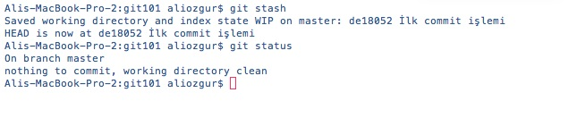
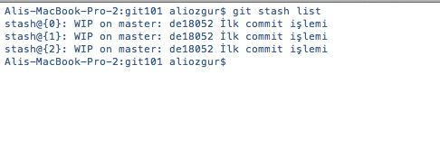
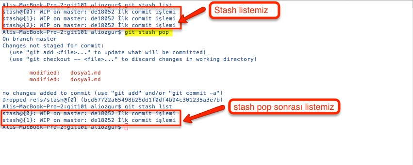
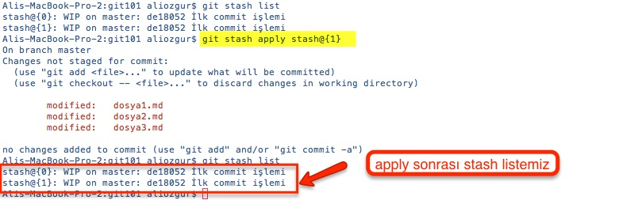
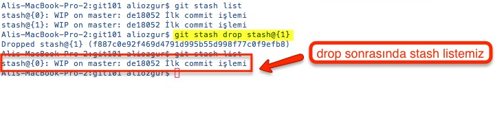

# Değişikliklerinizi Geçici Olarak Kaydetmek -&gt; Git Stash

Commit işlemi ile dosyalarınızda yaptığınız değişiklikler kalıcı olarak repository'de kayıt altına alınır. Ancak günlük çalışmamızda bazen tam olarak bitmeyen değişiklikleri de kayıt altına almak isteyebiliriz. Örneğin bir değişiklik üzerinde çalışırken başka bir konu ile ilgili kritik bir sorun bildirildiğinde yapmakta olduğumuz işi yarım bırakıp yeni soruna odaklanmak zorunda kalabilirsiniz.

Bu gibi durumlarda yeni sorun ile ilgilenmeye başlamak için önceki değişikliklerinizi kaybetmeden yeni ve temiz bir branch oluşturmalısınız. Yarım kalan değişiklikleri kayıt altına almak için **git stash** komutunu kullanmalısınız.

**git stash** ile üzerinde çalıştığınız ancak henüz commit etmediğiniz değişikliklerin geçici olarak Git tarafından kayıt altına alınmasını ve aktif branch'inizin herhangi bir değişikliğin olmadığı temiz bir duruma getirilmesini sağlarsınız. **git stash** komutunu çalıştırdıktan sonra tekrar **git status** komutunu çalıştırırsanız önceki bölümde commit edilmemiş bir değişiklik olarak görünen _dosya2.md_ dosyasındaki değişiklik artık listelenmez çünkü **master** branch’imiz **git stash** sonrası temiz bir duruma geldi.

**git stash list** komutunu kullanarak aktif branch'inizde geçici olarak kayıt altına aldığınız değişikliklerin listelenmesini sağlayabilirsiniz.

Yukarıda görünen listede en son stash işlemi ile geçici olarak kaydedilen değişiklikler en üstte yer alır. Stash'de yer alan bir değişikliği geri yüklemek istediğinizde iki seçeneğiniz var

* **git stash pop** komutu ile yukarıdaki listenin en üstünde yer alan değişiklik geri yüklenecek ve bu değişiklik listeden silinecek. 
* **git stash apply**  komutu ile istediğiniz değişikliği geri yükleyebilirsiniz. Ancak bu işlem sonrasında yüklediğiniz değişiklik listeden **silinmeyecek**. 

Herhangi bir değişikliği listeden silmek için **git stash drop**  komutunu kullanabilirsiniz.

## Stash Başka Hangi Durumlarda Kullanılabilir?

Stash işlemini üzerinde çalıştığımız aktif branch'imizi temiz bir duruma getirmek için kullanabiliriz. Bunun dışında aşağıdaki durumlarda da Git'in Stash özelliğini kullanabilirsiniz

* Farklı bir branch'i aktif hale getirmeden önce
* Remote Repository değişikliklerinizi yerel diskinize indirmeden önce
* Branch'inizi merge etmeden önce

