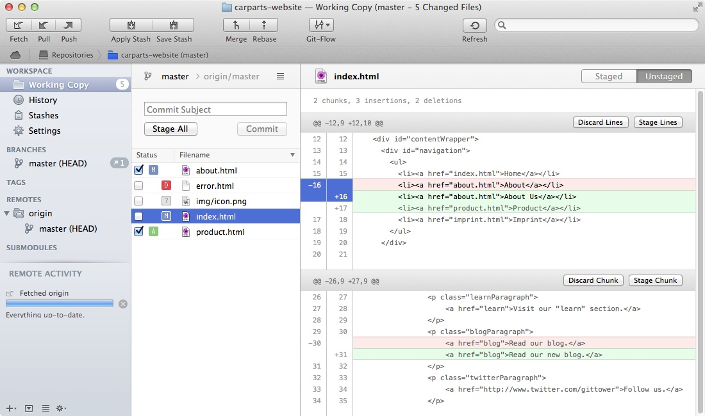
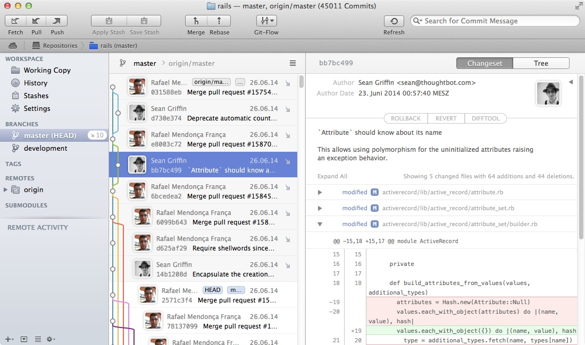

# Görsel Git İstemcileri

Önceki bölümlerde Terminal kullanarak birçok Git komutununun nasıl kullanıldığını size gösterdik. Ancak günlük çalışmanızda her bir komutun ayrıntılı olarak ne işe yaradığını, hangi parametreler ve seçenekleri kabul ettiğini aklınızda tutumak zor olacaktır. Bu nedenle Git'i günlük iş akışınıza entegre edip Git kavramlarını öğrendikten sonra görsel bir Git istermcisi kullanmak işinizi ciddi oranda kolaylaştıracaktır.

### Atlassian SourceTree

SourceTree ücretsiz bir uygulama. SourceTree'yi Mac OS X ve Windows işletim sistemlerinde kullanabilirsiniz.

[SourceTree'yi bu linkten indirebilirsiniz](http://www.sourcetreeapp.com/)

### Tower

Tower, sadece Mac OS X'de çalışan ücretli bir uygulama.[Bu linki](http://www.git-tower.com/) kullanarak uygulamanın 30 günlük deneme sürümünü indirebilirsiniz.

   

## GitHub

Projelerinizin kaynak kodunu [GitHub'da](http://www.github.com) tutuyorsanız GitHub'ın ücretsiz Mac OS X ve Windows için geliştirdiği kullanımı oldukça kolay olan ve Git'in karmaşasından sizi bir nebze olsun uzaklaştırabilecek uygulamasını kullanabilirsiniz. Bu uygulamanın Mac OS X versiyonunu [buradan](https://mac.github.com) ve Windows versiyonunu da [buradan](https://windows.github.com) indirebilirsiniz.

> Windows versiyonunda GitShell isimli Terminal benzeri uygulamanın kurulumu da yer alıyor. Bu nedenle daha karmaşık Git komutları için Terminal benzeri bir deneyim istiyorsanız GitShell'i rahatlıkla kullanabilirsiniz.

## TortoiseGit

Windows kullananlar ücretsiz bir uygulama olan Tortoise Git uygulamasını [bu linkten](https://code.google.com/p/tortoisegit/) indirip kullanabilirler. Özellikle daha önce Subversion ve TortoiseSVN kullananlar için TortoiseGit benzer bir deneyim sunmaktadır.

### Multiplatform İstemciler

* [GitEye](http://www.collab.net/products/giteye)
* [SmartGit](http://www.syntevo.com/smartgit/)

### Linux'a Özel İstemciler

* [gitg](https://wiki.gnome.org/Apps/Gitg/)
* [giggle](https://wiki.gnome.org/Apps/giggle/)
* [GitForce](http://gdevic.github.com/GitForce)
* [RabbitVCS](http://www.rabbitvcs.org/)

## Diğer Uygulamalar

Diğer görsel Git uygulamalarını Git'in [kendi sayfasından](http://git-scm.com/downloads/guis) inceleyebilirsiniz.

