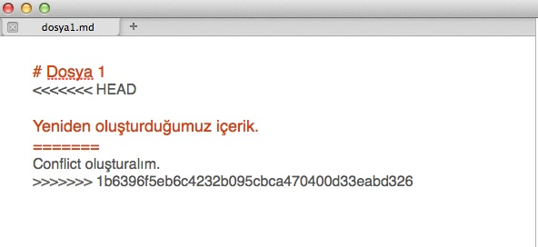

# Çakışmaları Gidermek

Versiyon kontrolü ile ilgili insanların en sevmedikleri ve korktukları şey değişiklikleri entegre etme \(merge\) işlemi sırasında oluşan çakışmalar ve bu çakışmaların çözülmesi sürecidir. Bu bölümde çakışmalardan korkmamamız gerektiğini ve çakışmaları en kolay ve efektif bir şekilde nasıl çözebileceğimizi ele alacağız.

## Git ile güvendesiniz

Git ile çalışıyorsanız istediğiniz zaman yanlış yaptığınız değişiklik entegre etme işlemini geri alarak bu işleme temiz dosyalar ile yeniden başlayabilirsiniz. Bu konuda Git'e güvenmeniz yeterli olacaktır. Merge işlemi sırasında işin çoğunu Git sizin yerinize otomatik olarak yapacak ve size sadece basit çakışmaları çözmek kalacaktır. Git'in diğer bir güzel tarafı ise çakışmaların sadece kendi local branch'inizde olması ve hiçbir zaman sunucu tarafında olamamasıdır. Böylece merge işlemi sırasında meydana gelen çakışmada takım arkadaşlarınız etkilenmeyecektir.

## Çakışma Nasıl Oluşur?

Git'de **merge** işlemi başka bir branch'deki değişiklikleri üzerinde çalıştığınız kendi branch'inize entegre etme işlemidir. Git merge işlemi sırasında değişikliklerin çoğunu sizin için otomatik olarak entegre eder.

Ancak bazı durumlarda Git merge işlemini otomatik olarak gerçekleştiremez ve sizin müdahale ederek hangi değişikliğin nasıl entegre edileceğine karar vermeniz gerekir. Bu durum genellikle aynı dosya üzerinde değişiklikler yapıldığında ortaya çıkar, bu durumda bile Git dosyadaki değişiklikleri nasıl entegre edileceğine çoğu zaman otomatik karar verebilir. Fakat aynı satırda yapılan değişiklikler veya takımdaki bir kişinin bir satırı silmesi durumunda sizin bu değişikliği kendi branch'inize nasıl entegre edileceğine karar vermeniz gerekir. Bu durumda Git dosyanızı conflicted \(çakışmalı\) olarak işaretler ve sizin çalışmanıza devam edebilmeniz için bu çakışmayı çözmeniz gerekir.

## Çakışmaları Nasıl Çözeriz

Çakışma oluştuğunda ilk yapmanız gereken şey çakışmanın neden olduğunu anlamak olmalıdır. Örneğin takım arkadaşınız aynı dosyada sizin de değiştirdiğiniz bir satırı mı değiştirdi veya aynı dosyada bir satır mı sildi veya sizinle aynı isimli yeni bir dosya mı oluşturdu?

**git status** komutunu çalıştırdığınızda Git size branch'inizde entegre edilmemiş dosyalar olduğunu söyleyecektir.

Yukarıdaki ekran görüntüsünde **dosya1.md** isimli dosyamızda çakışma olduğunu görebiliriz. Bu çakışmayı düzeltmek için dosyamızı açıp çakışan satırları düzeltmemiz gerekiyor.

dosya1.md dosyasını açtığımızda yukarıdakine benzer bir görüntü ile karşılaşıyoruz.

* **&lt;&lt;&lt;&lt;&lt;&lt;&lt;&lt;&lt; HEAD** ile başlayan ve  **============**  kadar devam eden kısım dosyanın bizim branch'imizde olan versiyonuna ait
*  **================**  belirtecinden sonraki kısım da değişiklikleri entegre etmek istediğiniz branch'de yer alan dosyanın içeriğini gösterir.

> **$ git mergetool dosya1.md** komutunu çalıştırarak önceki bölümlerde konfigürasyon ayarlarını yaptığımız DiffMerge uygulamasını da açabilirsiniz. 

Dosyamızın içeriğinin ne olacağına karar verip kaydettikten sonra normal bir commit işlemi ile çakışmayı çözme işlemini tamamlıyoruz.

> * **$ git add dosya1.md** ile dosyamızı Staging Area'ya ekliyoruz
> * **$ git commit -m "değişiklikler entegre edildi"** komutu ile de commit işlemini tamamlarız.

## Merge İşlemini Nasıl Geri Alabiliriz?

Dosyanızın merge işlemine başlamadan önceki haline istediğiniz zaman geri dönebilirsiniz. Bunun için yapmanız gereken tek şey **git merge --abort** komutunu çalıştırmak.

