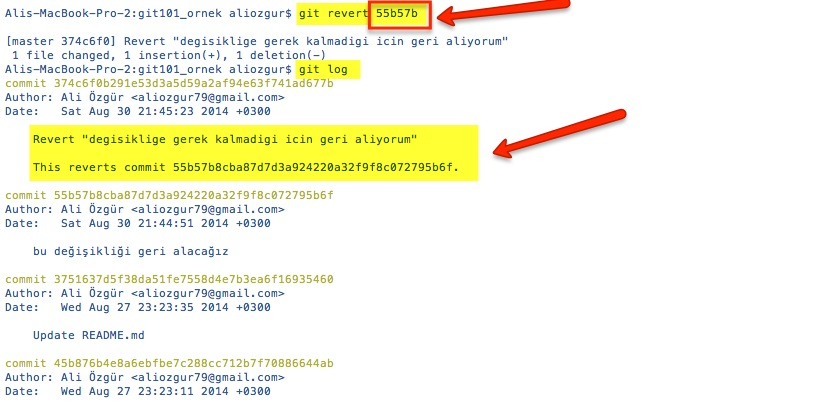
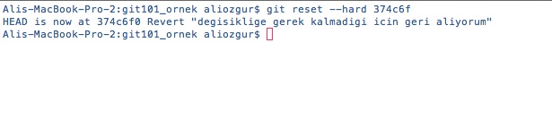

# Değişikliklerinizi Geri Almak

Git'in en güzel yanlarından biri de yaptığınız herhangi bir değişikliği kolayca geri alabilmemizi sağlamasıdır.

## Son Commit Bilgilerini Düzeltmek

Commit işlemlerinizi ne kadar dikkatli yaparsanız yapın bazen commit'e dahil etmeyi unuttuğunuz veya yanlışlıkla dahil ettiğiniz dosyalar olabilir veya commit mesajında eksik bilgi vermiş olabilirsiniz. Bu durumda son commit işleminizi yeniden yapmak için **git commit** komutunu **--amend** seçeneği ile kullanabilirsiniz. Sadece commit mesajınızı değiştirmek istiyorsanız **-- amend -m** seçenekleri ile git commit komutunu çalıştırabilirsiniz, eğer son commit'e dosya eklemek veya dosya çıkarmak isterseniz commit komutundan önce önceki bölümlerde de bahsettiğimiz **git add** ve **git rm** komutları ile önce Staging işlemini yapabilirsiniz.

Versiyon Kontrolünün Altın Kuralları

\#5 Asla Yayınlanmış Commitlerinizi Düzeltip Tekrar Yayınlamayın

 \*\*git commit\*\* komutunun --amend seçeneği commit hatalarımızı hızlıca ve kolayca düzeltebilmemiz için oldukça faydalı bir seçenektir. Ancak bu seçeneği kullanmadan önce aşağıdaki noktaları dikkate almalısınız

*  Bu seçenek sadece son commit işlemimizi düzeltmemizi sağlar, önceki commitlerimizi bu seçenek ile düzeltemeyiz.
*  Bu seçenek ile commit işlemi sonrasında bir önceki commit işlemine dair bilgiler silinir. Proje üzerinde çalışan tek kişi iseniz bu seçeneği kullanmanız sorun yaratmayacaktır ancak bir takım içinde yer alıyorsanız diğer takım arkadaşlarınız sonradan --amend ile düzeltttiğiniz hatalı commit işleminizi baz alarak kendileri de değişiklikler yapmış olabilirler. Bu durum takım arkadaşlarınız için sorun oluşturacaktır, çünkü onların baz aldıkları commit ile ilgili Git'de artık herhangi bir kayıt yer almayacak.

## Local Değişiklikleri Geri Almak

Henüz commit etmediğimiz değişikliklere Local değişiklik denir. Bazen önceki halinden daha kötü olan kod yazabilirsiniz ve bu değişikliği geri almak isteyebilirsiniz. Bu gibi durumlarda değiştirdiğiniz halinden memnun olmadığınız dosyadaki değişiklikleri geri alıp dosyanın son commit edilmiş haline geri dönmek istediğinizde, önceki bölümlerde de sıkca kullandığımız, **git checkout** komutunu **--** seçeneği ile çalıştırmanız yeterli olacaktır.

> * **$ git checkout -- dosya1.md** veya
> * **$ git checkout -- klasor/dosya2.md**
>
>   şeklinde kullanabilirsiniz.

Tüm dosyalarda yaptığınız değişiklikleri geri almak istiyorsanız **git reset** komutunu **--hard** seçeneği ile kullanabilirsiniz

> **$ git reset --hard HEAD**

Bu komut ile Git tüm dosyaların son commit edilen değişiklikleri içeren HEAD versiyonundaki hallerinin Working Copy'nize geri yükler.

> **git checkout --** ve **git reset --hard** komutları sonrasında kayıt altına alınmamış olan tüm değişiklikler geri dönüşü olmayacak şekilde yok olur. Bu nedenle bu komutları çalıştırırken dikkatli olmalısınız ve iki defa düşünmelisiniz.

## Commit Edilen Bir Değişikliği Geri Almak

Hatalı bir düzenleme yaptığınızda \(ki bu genelde test edilmeden yapılan commit'ler sonrasında oluşan bir durumdur\) veya geliştirdiğiniz bir özelliğin artık gerekli olmadığına karar verildiğinde yaptığınız değişikliği geri almanız gerekecektir.

**git revert** komutu commit ettiğiniz herhangi bir değişikliği geri almak için kullanılır. Bu komut ile commit işleminizin kendisi veya bilgileri silinmez sadece commit işleminizdeki değişiklik geri alınır. Örneğin eklediğiniz bir satırı kaldırmak isterseniz **git revert** komutu ile bunu yapabilirsiniz. Aslında git revert komutu değişikliğinizi geri almak için otomatik olarak yeni bir commit oluşturur ve geri alma işlemi bu commit sayesinde değişiklik tarihçesinde görünür hale gelir.

Yukarıdaki ekran görüntüsünde ilk önce **git revert**  komutunu çalıştırdık. Bu komutun en önemli parametresi geri almak istediğimiz commit'in hash değeri \(hash'in ilk yedi karakterini kullanabiliriz\). Komutu çalıştırdıktan sonra değişiklik tarihçesini incelediğimizde git'in otomatik olarak bir commit oluşturduğunu ve bu commit'in bilgilerinde hangi değişikliğin geri alındığına dair ayrıntıların yer aldığını görüyoruz.

Değişiklikleri geri almak için kullanabileceğimiz diğer bir komut ise **git reset** komutu. Bu komut da herhangi bir bilginizi silmeden işlemi gerçekleştirir, ancak git revert komutundan farklı olarak otomatik yeni bir commit üretmeden değişikliğinizi geri almanızı sağlar.

Bu komut için de git revert komutunda olduğu gibi geri almak istediğimiz commit'in hash değerini veriyoruz. Kullandığımız diğer bir seçenek olan **--hard** seçeneği ise local tüm commitlerinizi silerek geri alma işleminin yapılmasına neden olur, bu nedenle --hard seçeneğini kulllanırken dikkatli olmalısınız. Local commit'lerinizin korunmasını istiyorsanız **--keep** komutunu kullanabilirsiniz.

> **30 gün iade garantisi!** git reset komutu ile geri alma işlemi sonrasında geri aldığınız noktadan sonraki tüm değişiklikler tarihçeden silinecektir. Ancak git bu silinen bilgileri 30 gün kadar veritabanında tutmaya devam edecektir. Eğer yanlışlıkla geri alma işlemi yaptığınızı farkederseniz 30 gün içinde silinen herhangi bir commit'inizi geri alabilirsiniz.
>
> * [30 günlük süre nasıl değiştirilebilir](http://www-cs-students.stanford.edu/~blynn/gitmagic/ch07.html)
> * [Silinen commit hangi komutlar ile geri alınır](http://gitready.com/advanced/2009/01/17/restoring-lost-commits.html)

