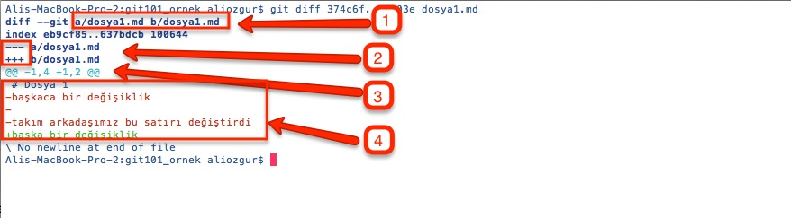
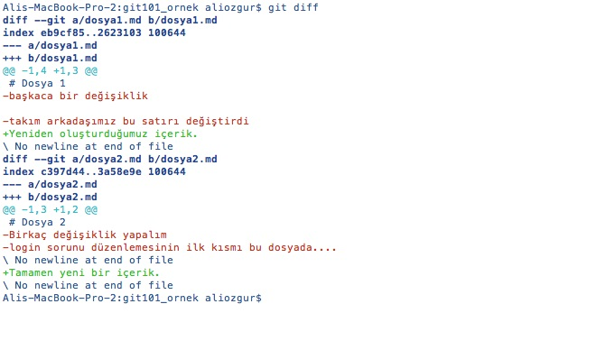

# Diff İle Farkları İncelemek

Daha önceki bölümlerde bolca kullandığımız **git status** ve **git log** komutları yaptığınız değişiklikler ile ilgili önemli bilgiler sunar. Ancak bu iki komut ile sadece değişikliklerimizin genel bilgilerini görebiliriz, dosyalarımızda yaptığımız değişikliklerin ayrıntılarını bu komutlar ile göremeyiz. Git'de bu iki komut dışında değişiklikleri ve farkları incelemek için farklı komutlar da yer alır.

## İki versiyon arasındaki farkları yorumlamak

Versiyon kontrol sistemlerinde iki versiyon arasındaki değişikliklere İngilizce difference \(fark\) kelimesinin kısaltması olan **diff** denir. Git'de iki versiyon arasındaki farkları görmek için **git diff** komutunu kullanabilirsiniz. Örneğin **git diff 374c6f..5d903e dosya1.md** komutu ile dosya1.md dosyasının 374c6f ve 5d903e hash'li commitlerdeki iki versiyonunun diff'ini alıyoruz.

git diff komutunu çalıştırdığımızda yukarıdaki gibi bir ekran ile karşılaşacaksınız. Gelin şimdi bu ekranda numaralandırdığımız önemli alanlarda hangi bilgilerin bize gösterildiğini ele alalım

1. **Karşılaştırılan Dosyalar \(A/B\):** Diff komutu iki dosyayı birbiri ile karşılaştırır, A dosyası ve B dosyası. Bu A ve B dosyaları genelde aynı dosyanın \(bizim örneğimizde dosya1.md\) farklı versiyonlarıdır. Çok sık olmasa da diff işlemi ile tamamen farklı olan dosyaları \(örneğin dosya1.md ve dosya1\_enyeni.md\) da karşılaştırabilirsiniz. Hangi dosyaların karşılaştırıldığını açıkça belirtmek için diff komutunun çıktısı her zaman hangi dosyanın A hangi dosyanın da B olduğunu belirterek başlar.

   > Bu bilginin hemen altında **index** ile başlayan satırda pratik olarak pek işinize yaramayacak dosya bilgileri yer alır. Bu bilgilerden ilk ikisi karçılaştırılan versiyonların hash değeri sonuncusu da \(1000644\) dosya modu bilgisidir.

2. **A/B Dosya Simgeleri:** Dosya içeriğinin hangi kısmının A hangi kısmının da B dosyasına ait olduğunu belirtmek için kullanılan - ve + sembollerinden hangisinin hangi dosyaya ait olduğu bilgisi.
3.  **Fark İşaretçileri:** Diff komutu ile sadece iki dosya \(aslında versiyon da denilebilir\) arasındaki farkların olduğu satırlar gösterilir, dosyanın tamamı \(değişmeyen satırlar da dahil\) gösterilmez. @@ simgeleri ile başlayan satırda A ve B dosyaları arasındaki farklı satırların hangi satırdan başlayıp kaç satır olduğu bilgisi gösterilir. Bizim ekran görüntümüzde yer alan **@@ -1,4 +1,2 @@** bilgisi bize şunu söyler

   > \(-\) simgesi ile tanımlanan A dosyasından 1. satırdan başlayarak 4 satır, + simgesi ile tanımlanan B dosyasından 1. satırdan başlayarak 2 satır birbirinden farklı

4.  **Değişiklikleri Okumak :**  Değişen her satırın başında \(-\) veya \(+\) simgesi yer alır. Bu simgeler ile A ve B versiyonlarının içeriğinin ne olduğunu anlamamızda bize yardımcı olacaktır. Örnek ekran görüntüsünde  \(-\) ile başlayan ve A versiyondaki satırların daha sonra \(+\) ile başlayan B versiyonundaki satırlar ile değiştirildiğini görüyoruz.

## Local Branch'deki farkları incelemek

Daha önceki bölümlerde **git status** komutu ile Local branch'imizde hangi dosyaların değiştiğini görebileceğimizi öğrenmiştik. **git status** komutu ile dosyaların içeriğindeki değişiklikleri göremeyiz. İçerik değişikliklerini de görmek için doğrudan **git diff** komutunu herhangi bir parametre veya seçenek belirtmeden kullanabilirsiniz.

Sadece Staging Area'ya commit edilmek üzere eklenmiş/çıkarılmış dosyalardaki değişiklikleri görmek isterseniz **git diff --staged** komutunu kullanabilirsiniz.

## Commit edilmiş dosyalardaki farkları görmek

**git log** komutunu commit işlemleri ile ilgili özet bilgileri görmek için kullanabiliriz. Bu komutu herhangi bir parametre veya seçenek belirtmeden kullanırsanız dosya içeriğindeki farkları göremezsiniz. Dosyaların içeriğindeki farkları da görmek için _git log_ komutunu **-p** seçeneği ile kullanabilirsiniz.

> **$ git log -p** şeklinde

## İki Farklı Branch'i Karşılaştırmak

İki farklı branch'in arasındaki içerik farklarını görmek için _git diff_ komutuna karşılaştırmak istediğiniz branch isimlerini parametre olarak verebilirsiniz. Örneğin **master** ile **superyeniozellik** branch'ini karşılaştırmak için _git diff_ komutu aşağıdaki gibi olacaktır

> **$ git diff master..superyeniozellik**

Branch'leri karşılaştırabildiğiniz gibi iki farklı versiyon arasındaki tüm dosyaların içeriğini de versiyonların **hash** değerlerini _git diff_ komutuna parametre olarak vererek karşılaştırabiliriz. Örneğin

> **$ git diff 74c6f..5d903e**

komutu ile 74c6f hash değeri olan commit \(versiyon\) ile 5d903e hash değerine sahip commit'in dosyaları arasındaki farkları görebilirsiniz.

