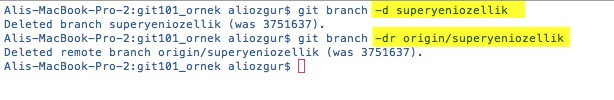

# Branch'leri Silmek

Bir önceki bölümde oluşturduğumuz **superyeniozellik** isimli branch üzerindeki çalışmamızı tamamlayıp kalite kontrol sürecimizi de işlettikten sonra bu değişiklikleri **master** branch'imize entegre ettiğimizi varsayalım. Bu entegrasyon sonrasında **superyeniozellik** isimli branch'e ihtiyacımız yok ve artık bu branch'i silebiliriz. Bu branch'i kendi bilgisayarımızdan silmek için **git branch -d superyeniozellik** komutunu, remote repository'den silmek için de **git branch -dr superyeniozellik** komutunu kullanabiliriz.

> Silmek istediğiniz local branch aktif ise **git branch -d** komutu hata verecektir. Silme işlemi öncesinde sileceğiniz local branch'den farklı bir branch'i **git checkout** komutu ile aktif hale getirmeyi unutmayın.

Remote branch'i **git branch -dr** komutu ile sildiğiniz halde remote repository'ye erişip branchleri kontrol ederseniz **superyeniozellik** isimli branch'in sunucuda hala durduğunuz göreceksiniz. Bunun nedeni **git branch -dr** komutundaki seçeneklerden **r** seçeneğinin sunucudaki branch'i değil yerel bilgisayarınızda remote branch bilgilerini siler. Bu değişikliğin sunucuda da geçerli olması için yani sunucudaki branch'i de silmek için **git push origin :superyeniozellik** komutu ile değişikliği bir anlamda remote repositry'de yayınlamanız gerekiyor.

> [Daha ayrıntılı bilgi için bakınız \(StackOverflow - İngilizce \)](http://stackoverflow.com/questions/24216725/deleting-remote-branch-does-not-remove-from-github)

