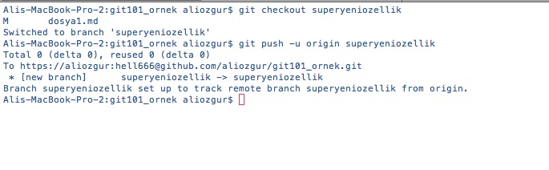
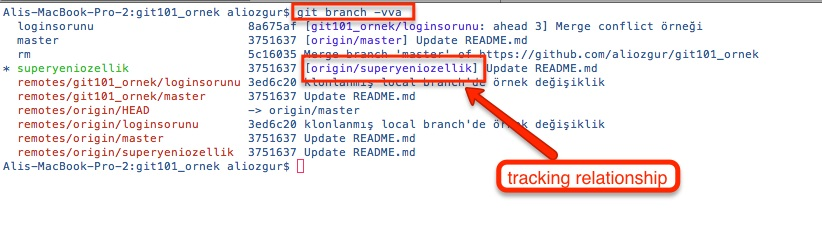

# Local Bir Branch'i Yayınlamak \(Publish\)

Kendi bilgisayarınızda oluşturduğunuz Local bir branch siz yayınlamaya karar vermediğiniz sürece sadece sizin bilgisayarınızda yer alacaktır. Yani local bazı branchlerinizi sadece kendi bilgisayarınızda tutarken istediklerinizi de takım arkadaşlarınız ve hatta tüm dünya ile paylaşabilirsiniz.

Gelin şimdi **superyeniozellik** isimli local branch'i remote repositorymizde paylaşalım.

Önce **git checkout** komutu ile branch'imizi aktif hale getiriyoruz ve sonra **git push** komutu ve **-u** seçeneği ile local branch'imizi remote repository'mizde yayınlıyoruz. Push komutu için verdiğimiz _origin_ ve _superyeniozellik_ değerleri ile **HEAD** branch'imizi **origin** remote repository'de **superyeniozellik** isimli branch olarak yayınlanmasını istediğimizi tanımlıyoruz. _-u_ seçeneği ise local branchimiz ile remote branchimiz arasında, önceki bölümlerde de bahsettiğimiz, Takip İlişkisi \(Tracking Relationship\) kurulmasını sağlar.

> git branch komutunu **-vva** seçeneği ile çalıştırdığınızda kurulmuş Takip İlişkisi bilgilerini de görebilirsiniz.

Local branch'i remote repository'de yayınladıktan sonra local branch'de yaptığımız değişiklikleri **git push** komutunu parametresiz kullanarak remote branch'imizde yayınlayabiliriz.

Artık remote repository'ye erişim yetkisi olan herkes **superyeniozellik** isimli bu branchinizi görebilir ve bu branch'i baz alarak kendi değişiklikleri üzerinde çalışma yapabilir.

