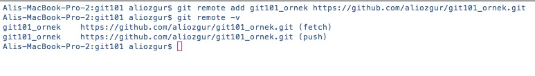

# Remote Bir Repository'ye Bağlantı Sağlamak

Remote bir repository'yi yerel diskinize **git clone** komutu ile indirdiğinizde Git otomatik olarak bu işlemi yapmak için kullandığınız bağlantı bilgilerini hatırlar. Git bu bilgi'yi varsayılan olarak **origin** adı verilen remote bir repository olarak kayıt altına alır. Local olan bir respository için ise böyle bir bilgi tutulmaz. Ancak bölüm girişinde de ele aldığımız gibi Local bir repository'yi baz alarak yeni bir remote repository oluşturabiliriz. Bunun için **git clone** komutunu kullanabiliriz. Örneğin

Yukarıdaki ekran görüntüsünde ilk komutumuz olan **git remote add**  ile local repository'miz ile remote repository'miz arasındak bağlantıyı kuruyoruz. İkinci komutumuz olan **git remote -v** ile de remote repositorymiz ile ilgili bilgileri görebiliriz.

Dikkat ettiyseniz her bir remote repository için biri **fetch** diğeri de **push** işlemleri için kullanılan iki adres bulunur. **fetch** adresini remote repository'den yapılacak olan okuma işlemleri, **push** adresini de remote repository'ye yapılan yazma işlemleri için kullanılır. Genel olarak bu iki adres aynı olmakla birlikte performans ve güvenlik gibi gerekçeler ile iki farklı adres de kullanılabilir.

> Local bir repository'nizi istediğiniz sayıda remote repository ile ilişkilendirebilirsiniz. Yukarıdaki ekran çıktısında sadece bizim oluşturduğumuz **git101\_ornek** isimli remote listeleniyor, birden fazla remote ilişkisi olsaydı hepsi listelenecekti.

