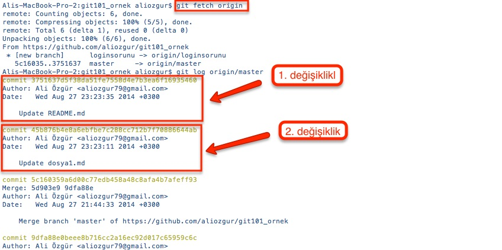

# Remote Değişiklikleri Entegre Etmek

Takım arkadaşlarınız kendi değişikliklerini tamamlayıp remote branch'de yayınladıktan sonra siz de bu değişiklikleri inceleyip kendi local branch'inize entegre ederek çalışmanıza devam edebilirsiniz. Ancak remote branch'deki değişiklikleri entegre etmeden önce bu değişikliklere ilişkin bilgileri \(dosyaları değil sadece değişikliklere dair Git'de tutulan bilgiler\) görmeniz ve incelemeniz gerekir.

Remote branch'deki değişiklikleri indirmek için **git fetch** komutunu kullanıyoruz. Git fetch komutuna geçilen _origin_ değeri ise daha önceki bölümlerde gösterdiğimiz _remotes/origin/master_ isimli remote branch bağlantısına referans vermek için kullanılır.

> _origin_ değeri **git fetch** komutunun bir parçası değil sadece bir parametre. Origin yerine daha önce local branchimiz ile bağlantısını/ilişkisini kurduğumuz herhangi bir remote branch'i gösteren bir değer olabilir.

_git fetch_ komutu ile remote branch'deki değişiklikleri indirdikten sonra ise **git log** komutunu kullanarak bu remote branch'deki değişiklikler ile ilgili bilgileri görebiliriz. \(değişiklik tarihi, kimin yaptığı, değişen dosyalar ve commiti sırasında girilen mesaj gibi\)

Değişiklikleri inceledikten sonra bunları local branch'inize entegre etmeye karar verdiğimizde ise **git pull** komutunu kullanmamız gerekecek

> Remote branchdeki değişikliklerin bilgilerini indirmek için kullanılan **fetch** \(türkçe anlamı [getirmek](http://www.seslisozluk.net/?word=fetch&lang=tr-en)\) ve bu değişiklikleri entegre etmek için kullanılan **pull** \(türkçe anlamı [çekmek](http://www.seslisozluk.net/?word=pull&lang=tr-en)\) ifadelerinin birbirine yakın anlamları olduğu için karıştırabilirsiniz. Bu karışıklığın önüne geçmek için yapacağınız en güzel şey **git pull** komutunu hiç kullanmamak olacaktır. Ayrıntılar için İngilizce bir blog post olan [_Git: fetch and merge, don't pull_](http://longair.net/blog/2009/04/16/git-fetch-and-merge/%20) inceleyebilirsiniz.

Git pull komutu aslında arka arkaya iki şey yapmanızı sağlar

* Remote branch'deki değişiklikler ile ilgili bilgileri indirmek, yani **git fetch**
* Remote branch'deki değişiklikleri local branch'inize entegre etmek yani **git merge**

İlerleyen bölümlerde çakışmaların tespit edilmesi, çözülmesi ve değişikliklerin entegre edilmesi konularını ayrıntılı olarak ele alacağız şimdilik sadece iş akışımızı özetleyip bu konuyu burada sonlandıralım. Akışımız özetle şöyle olacak

* git fetch : remote'dan güncelleme bilgilerini indir
* git diff : remote ve local arasındaki farkları incele
* git merge : değişiklikleri otomatik merge et çakışma varsa bir sonraki adıma geçin
* Çakışma olan dosyalarınızı açın ve çakışmaları düzeltin
* git add: çakışmanın giderildi ve değişiiklik Staging Area'ya alındı

