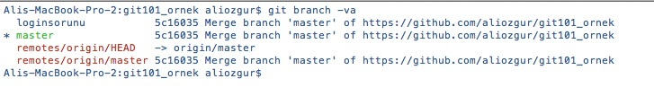
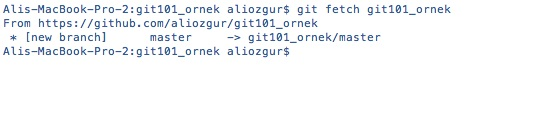
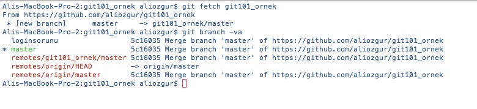
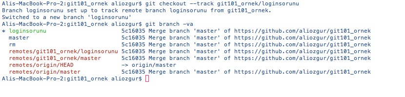
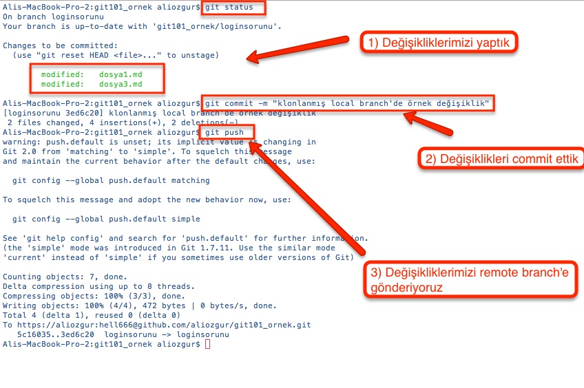

# Remote Repository'deki Verilerin İncelenmesi

**git clone** komutu remote bir repository'yi yerel diskimize indirdikten sonra **git branch -va** komutunu çalıştırdığımızda aşağıdaki görüntüde yer alan bilgiler listelenecektir.

Dikkat edecek olursanız local repository'lerimiz hala yerinde duruyor ancak listemizde ilave olarak **origin/HEAD** ve **origin/master** isimli iki remote kaydı var. Peki daha önceki bölümde **git add git101\_ornek**  komutu ile oluşturduğumuz remote repository kayıtlarımız neden listlenmiyor? Bunun nedeni önceki bölümde kullandığımız **git add** komutu ile local ve remote repository arasında sadece bir ilişki/bağlantı tanımladık, aslında bu komut sonrasında local ve remote arasında herhangi bir veri trasferi gerçekleşmez.

> **Remote Repository bilgileri güncel olmayabilir!** Git remote repository'ler ile ilgili yerel diskinizde bir takım bilgileri içerir. Ancak Git arka planda otomatik olarak bu bilgileri sizin için belirli aralıklarda güncellemez! Bu işlemin gerçekleşmesi ve sizin diğer takım arkadaşlarınızın yaptığı değişikliklerden haberdar olabilmeniz için Git'e bu bilgileri güncellemesini söylemeniz gerekir.

Git'in remote repository ile ilgili yerel diskinizde tuttuğu bilgileri güncellemesini sağlamak için **git fetch** komutunu kullanmanız gerekir.

Fetch komutu yerel diskinizdeki branchlerinizi ve Working Copy'deki dosyalarınızı güncellemez veya değiştirmez. Bu komut ile sadece takım arkadaşlarınızın remote repository'de yayınladıkları değişikliklere ilişkin bilgiler yerel diskinize indirilir. Daha sonra bu değişikliklerden hangilerini hangi local branch'e entegre edeceğinize kendiniz karar verebilirsiniz.

Bu işlemden sonra tekrar **git branch -va** komutunu çalıştırdığımızda **gitornek\_101/master** isimli remote repositorymizdeki branchlere ilişkin bilgileri de görebiliriz.

Bilgilerini güncellediğimiz git101\_ornek/master isimli branch'de değişiklikler yapmak için öncelikle bu branch'i baz alarak yeni bir local branch oluşturup dosyaların Working Copy alanımıza kopyalanmasını sağlamamız gerekiyor. Bunun için **git checkout** komutunu **--track** parametresi ile kullnıyoruz.

**git checkout --track** komutu ile aşağıdaki işlemler gerçekleşir

1. Remote branch ile aynı isimde local bir branch oluşturulur
2. Yeni oluşturulan branch aktif hale getirilir
3. --tracking parametresini kullandığımız için yeni oluşan local branch ile remote branch arasında "tracking relationship" adı verilen ve local branch'in hangi remote branch'deki değişiklikleri takip ettiğini gösteren ilişki kurulur

> **Tracking Relationship \(Takip İlişkisi\)**: Git'de daha önceki bölümlerde de bahsettiğimiz gibi branchler aslında birbirinden tamamen bağımsızdır ve aralarında doğrudan bir ilişki yoktur. Ancak _track_ parametresi ile local bir branch'in hangi remote branch'deki değişiklikleri takip edeceğini tanımlayabiliriz. Bu durumda Git iki branch'den herhangi birinde yer alan ancak diğerinde yer almayan commit'leri tespit ederek bizi bilgilendirecektir. Yani
>
> * Local branch'inizde remote branch'e yayınlamadığınız \(push\) commit'ler varsa bu durumda local branch'inizin remote branch'den önde \(ahead\) olduğu
> * Takım arkadaşlarınız remote branch'e bazı commitleri push ettiğinde ve siz de local branch'inizi güncellemediğiniz durumda local branch'inizi remote branch'in gerisinde \(behind\) olduğu
>
>   bilgisi Git tarafından "Tracking Relationship" tanımı sayesinde **git status** komutunun çıktısı olarak gösterilir

Local branch'imizi hazırladığımıza göre gelin şimdi birkaç değişiklik yapalım. Bu değişiklikleri yaptıktan sonra her zamanki gibi önce değişikliklerimizi Staging Area'ya alıyoruz ve sonrasında da commit işlemini gerçekleştirerek local repository'de versiyon kontrolüne ilişkin işlemlerimizi bitiriyoruz. Son adım olarak da **git push** komutu ile localdeki bu değişikliklerimizi remote branch'de yayınlıyoruz.

> **git push** push komutu aslında **git push**   formatındadır. Ancak local branch'imizi oluştururken kullandığımız _track_ parametresi sayesinde kurulan "Takip İlişkisi" sayesinde push komutunun uzun hali yerine sade hali olan **git push** formatında kullanabiliyoruz.

